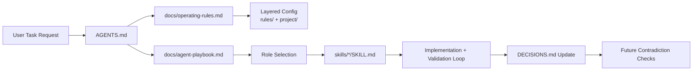

# Agent Playbook Template

## 30-Second TL;DR

This repository gives your team a reusable AI delivery workflow: clear agent roles, stable operating rules, reusable skills, and decision logging.

Use four concepts to orient quickly:

- `role` = who owns the work
- `intent mode` = what phase the work is in (`analyze`, `implement`, `review`, `document`)
- `execution_mode` = how much autonomy the agent has (`supervised`, `semi-auto`, `autonomous`)
- `budget.profile` = how much instruction surface loads (`nano`, `minimal`, `standard`, `full`)

Start here in order:
0. `prompt-budget.yml` (choose `budget.profile` / `execution_mode`)
1. If `budget.profile` is `nano`, read `docs/rules-nano.md` and stop there unless a specific lookup is needed.
2. Otherwise read `AGENTS.md` (entrypoint and loading order).
3. `docs/rules-quickstart.md` is the complete Layer 1 for `minimal`.
4. If `budget.profile` is `standard` or `full`, continue into `docs/operating-rules.md` and `docs/agent-playbook.md`.

Best for teams looking for: AI coding agent playbook, multi-agent software workflow, and documentation-driven engineering.

Reusable repository assets for AI-assisted software delivery:

- repo-wide agent rules
- project-level subagents
- reusable prompt templates
- reusable skills
- external-practice notes

This template is intentionally project-agnostic. Copy, adapt, and version it in any repository where you want stable agent behavior across planning, implementation, integration, review, and documentation.

## Quick Start (3 steps)

1. Copy this template into your repository (or create a repo from this template).
2. Edit the two source-of-truth docs first: `docs/operating-rules.md` and `docs/agent-playbook.md`. Update `AGENTS.md` after them as the root entrypoint.
3. Run your first task with the required workflow: discover -> triage -> plan (if needed) -> implement -> validate -> record decisions.

For first entry into a new repository, use the profile-aware initialization path: at `minimal`, follow the manual scan path in `docs/rules-quickstart.md`; at `standard`/`full`, run `skills/on-project-start/SKILL.md` before implementation.

If you only do one thing on day one: keep `DECISIONS.md` updated so future agent runs can perform contradiction checks.

## Mental model

This template is for governing agent behavior, not for shipping a particular runtime or product feature set.

Read it in this order:

1. `docs/operating-rules.md` defines safety, scope, checkpoints, and intent-mode rules.
2. `docs/agent-playbook.md` defines role ownership, capability ceilings, routing, and workflow paths.
3. `docs/agent-templates.md` defines the required output contracts such as handoffs, checkpoints, and rule-entry format.

Practical interpretation:

- choose a `role` for ownership
- choose an `intent mode` for the current phase
- use `execution_mode` to decide whether human approval gates stop or auto-proceed
- use `budget.profile` to decide how much of the framework loads

## Example: Complete Use Case

Use case: add a new repository rule that all API handlers must enforce request ID logging.

1. Update rule source: add the non-negotiable rule in `docs/operating-rules.md` under Project-specific constraints.
2. Align routing and role guidance: update `docs/agent-playbook.md` if any role ownership changes.
3. Sync tool instructions: update `.github/copilot-instructions.md` to keep tool-specific guidance consistent.
4. Record the decision: append a dated entry to `DECISIONS.md` with context, decision, alternatives, and constraints.
5. Validate consistency: ensure `AGENTS.md` matches `docs/operating-rules.md` and `docs/agent-playbook.md`.

Outcome: every future implementation task follows the same logging requirement with traceable reasoning.

## Copy and Paste Snippets

### 1) Task kickoff prompt

```text
Goal: [what to change]
Scope: [files/modules allowed]
Constraints: follow AGENTS.md and docs/operating-rules.md
Deliverable: proposal + implementation + validation results
```

### 2) Mandatory first-response compliance block

```text
Read set: [list of files read]
Scale: [SMALL|MEDIUM|LARGE] + reason
Workflow path: [small simplification | medium/large full path]
Checkpoint map: [plan approval, destructive actions, scope expansion]
```

### 3) Decision log entry template

```markdown
## YYYY-MM-DD: [Decision title]
- **Context**: Why this decision was needed
- **Decision**: What was decided
- **Alternatives considered**: What was rejected and why
- **Constraints introduced**: What future work must respect
```

## Architecture Diagram



## Layered Configuration

This template supports layered constraint files so teams can adapt behavior without rewriting one large rules file.

- `rules/global/` — core communication, coding, and security rules
- `rules/domain/` — domain-specific constraints (backend, cloud, frontend, etc.)
- `project/project-manifest.md` — project-local context and boundaries

When constraints conflict, follow precedence defined in `docs/operating-rules.md`: Project Context -> Domain Rules -> Global Rules.

For rule placement, same-layer conflict handling, and governance checks, see `docs/layered-configuration.md`.

For staged simplification and automation steps, see `docs/rule-optimization-plan.md`.

## End-to-End Flow

1. Discover context: read relevant code/docs and existing decisions.
2. Initialize (first entry only): run `on-project-start` to confirm boundaries.
3. Triage task scale: classify as Small, Medium, or Large using evidence.
4. Plan path: Small uses the simplified path; bounded Medium work may go directly to implementation; ambiguous, high-risk, or cross-module Medium/Large work uses the full planning path.
5. Implement safely: keep scope tight and follow repository patterns.
6. Validate: run targeted checks/tests, fix, and repeat until stable.
7. Record durable state: update `DECISIONS.md` when behavior or architecture choices are made.

This flow is what makes the template useful in real teams: predictable output quality, lower drift, and faster onboarding.

## Search Keywords and Discoverability

This template is designed for teams searching for:

- AI coding agent playbook template
- GitHub Copilot repository instructions template
- multi-agent software workflow for planning and implementation
- documentation-driven engineering workflow
- decision log and contradiction-check workflow

If you maintain a fork, keep these phrases in your repository description and README summary so more users can discover and adopt your workflow.

## What this repository gives you

- a root `AGENTS.md` entrypoint
- reusable operating rules and routing rules
- project-level subagents for Claude-compatible tooling
- reusable prompt templates for any chat-based coding tool
- reusable skills you can adapt into your own agent ecosystem
- repo-wide Copilot instructions

## Current asset inventory

- Claude subagents: 8 (`.claude/agents/*.md`)
- Reusable skills: 16 (`skills/*/SKILL.md`)
- Source-of-truth docs: `docs/operating-rules.md`, `docs/agent-playbook.md` (`AGENTS.md` is the root entrypoint that should stay aligned with them)

## Example gallery

Use `examples/` for ready-to-adapt constraint profiles:

- `examples/high-security-mode.md`
- `examples/mvp-rapid-mode.md`
- `examples/legacy-maintenance.md`

## Required vs optional files

### Required

- `AGENTS.md`
- `prompt-budget.yml`
- `docs/rules-nano.md`
- `docs/rules-quickstart.md`
- `docs/operating-rules.md`
- `docs/agent-playbook.md`

### Strongly recommended

- `DECISIONS.md` — effectively required if you want contradiction checks and durable decision memory
- `ARCHITECTURE.md`
- `.github/copilot-instructions.md`
- `.claude/agents/`
- `skills/`
- `docs/agent-templates.md`

### Optional

- `docs/example-task-walkthrough.md` — reference for expected output formats
- `docs/external-practices-notes.md`
- `docs/adoption-guide.md`

## Adoption path

1. Create a new repository from this template or copy the files into an existing repository.
2. Edit `docs/operating-rules.md` with your real safety, testing, and review expectations.
3. Edit `docs/agent-playbook.md` so the role routing matches your stack.
4. Update `AGENTS.md` so the root entrypoint reflects those source-of-truth docs.
5. Review and replace `ARCHITECTURE.md` with your repository's module map and data flow (the template repo now includes its own reference architecture).
6. Keep, rename, or remove subagents in `.claude/agents/` based on the tools your team actually uses.
7. Keep, rename, or remove skills in `skills/` based on the workflows you repeat often.
8. Update `.github/copilot-instructions.md` so it reflects the same role model.
9. Keep `DECISIONS.md` active from day one so agents can run contradiction checks before planning/implementation.
10. Apply memory lifecycle rules from `skills/memory-and-state/SKILL.md` (archive stale decisions when thresholds are hit and use selective reads for active vs. archived decisions).
11. Update `prompt-budget.yml` so the budget profile, execution mode, and enabled roles/skills match your project.

## Customization checklist

- Replace generic module labels with your actual modules.
- Add repository-specific safety rails, test commands, and release rules.
- Add or remove role definitions to match your delivery workflow.
- If your team does not use Claude-style subagents, keep the role names but remove `.claude/agents/`.
- If your team does not use Copilot instructions, remove `.github/copilot-instructions.md`.
- See `docs/adoption-guide.md` → Tool adapter reference for Cursor, Windsurf, and OpenAI API setup.

## Portability note

The role names in this template are conceptual first:

- `feature-planner`
- `backend-architect`
- `application-implementer`
- `ui-image-implementer`
- `integration-engineer`
- `documentation-architect`
- `risk-reviewer`
- `critic`

Some tools can map these directly to project subagents. Others cannot. In tools without native subagents, use the same role names through prompt templates, reusable skills, or repository instructions instead.
