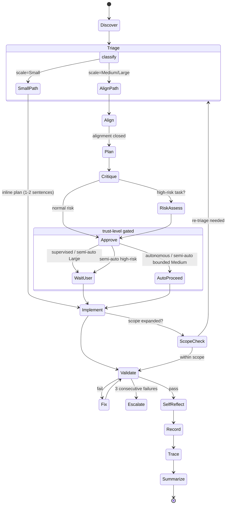

# Agent Playbook

## Three-layer architecture

All agent work follows three layers:

1. **Rules** (`docs/operating-rules.md`) — hard constraints: safety, scope, agent-deference, trust level, codebase discovery, validation loop, error recovery, project-specific constraints, decision log.
2. **Skills** (`skills/*/SKILL.md`) — reusable capabilities: repo exploration, test-and-fix loop, error recovery, memory management, prompt cache optimization, self-reflection, observability, MCP validation, plus domain skills (planning, backend, frontend, design, docs).
3. **Loop** — every implementation follows: Discover → Triage → [Align] → Plan → Critique → Approve → Implement → Test → Fix → Repeat → Record → Summarize. `[Align]` runs `alignment-loop` on Medium/Large tasks before planning. `Approve` is the primary trust-level-gated wait state; routing into planning, critique, and summary still depends on task shape, scale, and workflow. See `docs/operating-rules.md` → Trust level for activation rules.

> **Note:** The 11-stage loop above is a conceptual overview. The detailed expansion into 16 mandatory steps (below) adds initialization, structured preamble, test-first, cache-aware loading, isolation, self-reflection, delivery formatting, observability traces, and the feedback loop. Both views describe the same workflow at different levels of granularity.

## Layered configuration model

In addition to the execution architecture above, repository constraints should be organized into:

1. **Global Rules** — `rules/global/`
2. **Domain Rules** — `rules/domain/`
3. **Project Context** — `project/project-manifest.md`

Precedence follows `docs/operating-rules.md` → Layered configuration and Conflict resolution principle.

## Skill activation tiers

Not all 18 skills must execute on every task. Skills are classified into three activation tiers:

### Always (minimum required)

These skills run on **every task regardless of scale or trust level**. They form the minimum viable agent workflow.

| Skill | Why mandatory |
|-------|---------------|
| `demand-triage` | Determines scale, which controls all downstream behavior |
| `repo-exploration` | Prevents blind coding; required by codebase discovery rules |
| `test-and-fix-loop` | Validation is never optional — every code change must be verified |
| `error-recovery` | Agents must handle failures, not ignore them |
| `memory-and-state` | DECISIONS.md reads and contradiction checks are mandatory |

### Conditional (activate by trigger)

These skills activate only when their trigger condition is met. If the condition is not met, skip entirely.

| Skill | Trigger condition |
|-------|-------------------|
| `on-project-start` | First entry into an unfamiliar repository only |
| `self-reflection` | Before emitting any deliverable or handoff (all scales, but Small uses 2/5 dimensions) |
| `observability` | After task completion (Small: inline trace; Medium/Large: structured file) |
| `prompt-cache-optimization` | When loading instructions — controls Layer 1-4 ordering |
| `alignment-loop` | Medium/Large tasks before entering feature-planning — surfaces design gaps and forces explicit decisions |
| `ubiquitous-language` | First repo entry (via `on-project-start`), or when any new domain term appears that is not yet in the glossary |
| `feature-planning` | Medium/Large tasks that need a plan-first approach |
| `backend-change-planning` | Backend contract, schema, or permission changes |
| `mcp-validation` | Only when `project/project-manifest.md` declares MCP tools |

### On-demand (opt-in)

These skills are loaded only when the task type matches. Projects that do not use these domains can remove them entirely (see `docs/adoption-guide.md` → Prompt budget trimming).

| Skill | When to load |
|-------|-------------|
| `application-implementation` | General product or frontend implementation tasks |
| `design-to-code` | Screenshot-driven or mockup-driven UI work |
| `documentation-architecture` | Documentation-as-deliverable tasks |
| `skill-creator` | Self-evolution identifies a new skill need, or user requests a new reusable skill |

### Applying the tiers

1. At task start, **always perform the 5 mandatory skill behaviors** — either by loading the skill file, or (at `minimal`/`nano` profile) by executing the behavior natively using tool capabilities.
2. Check trigger conditions and load applicable **conditional skills**.
3. Load **on-demand skills** only when the task domain matches.
4. Record which skills were loaded in the trace (for observability and future optimization).

This classification aligns with `prompt-budget.yml` — the `always_load`, `on_demand`, and `disabled` lists should mirror these tiers.

For `prompt-budget.yml`, conditional skills that do not justify a dedicated key may be listed under `on_demand` as long as their trigger condition is documented and they are not treated as unconditional always-load skills.

> **Note**: At `minimal` and `nano` profiles, Always-tier *behaviors* remain mandatory, but the skill files themselves may not be loaded. Agents execute demand-triage, repo-exploration, test-and-fix-loop, error-recovery, and memory-and-state using native tool capabilities instead of loading the SKILL.md files.

### Budget profiles

Users with limited agent token budgets can select a **named budget profile** in `prompt-budget.yml` to control how many skills and roles are loaded. Each profile is a pre-configured combination of skills, roles, and layer targets.

| Profile | Skills loaded per request | Roles available | Layer 2 target | Recommended when |
|---------|--------------------------|-----------------|----------------|------------------|
| **nano** | 0 (native tool capabilities only) | 1 (application-implementer) | ≤ 0 tokens | < 3,000 total token budget; single-file Small tasks only |
| **minimal** | 2 (demand-triage, repo-exploration) | 2 | ≤ 4,000 tokens | Token budget < 16K or pay-per-token with tight limits |
| **standard** | 5 (all Always-tier skills) | 4–5 | ≤ 8,000 tokens | Typical team usage with moderate token budget |
| **full** | 5 + all applicable Conditional + On-demand | All enabled | ≤ 15,000 tokens | Generous token budget; large or high-risk projects |

#### Nano profile

Loads zero skills. Agents rely entirely on native tool capabilities. Layer 1 is a single self-contained file (`docs/rules-nano.md`, ~630 tokens) covering constitutional principles, always-dangerous operations, a 5-step workflow, and escalation triggers.

- **Skills**: none (all skill behaviors executed natively)
- **Roles**: `application-implementer` only
- **Layer 1**: `docs/rules-nano.md` only — do not load AGENTS.md, operating-rules.md, or agent-playbook.md
- **Suitable for**: single-file Small tasks only. Agent escalates immediately if the task is multi-file, requires design decisions, or touches auth/schema/CI.
- **Total estimated execution**: ~2,000–2,500 tokens

#### Minimal profile

Loads only the two skills required for triage and codebase navigation. Other skills are inlined or skipped:

- **Skills**: `demand-triage`, `repo-exploration`
- **Roles**: `application-implementer`, `critic` (all others disabled)
- **Validation**: agent runs tests directly without loading `test-and-fix-loop` skill (uses tool-native test execution)
- **Error recovery**: agent uses built-in retry logic; `error-recovery` skill is not loaded
- **Memory**: agent reads `DECISIONS.md` directly; `memory-and-state` skill is not loaded
- **Trade-offs**: no separate planning skill, abbreviated reflection/trace behavior, and handoffs only when a same-session role transition genuinely occurs. Suitable for Small tasks only.

#### Standard profile

Loads all 5 Always-tier skills. Conditional skills activate normally by trigger.

- **Skills always loaded**: `demand-triage`, `repo-exploration`, `test-and-fix-loop`, `error-recovery`, `memory-and-state`
- **Conditional skills**: activate by trigger (self-reflection uses 2/5 dimensions for Small tasks)
- **Roles**: `feature-planner`, `application-implementer`, `risk-reviewer`, `critic`
- **Trade-offs**: on-demand domain skills (design-to-code, documentation-architecture) require explicit opt-in; full observability traces may be abbreviated.

#### Full profile

Loads all applicable skills per the tier classification. No restrictions.

- **Skills**: all Always + all triggered Conditional + matching On-demand
- **Roles**: all enabled roles
- **Self-reflection**: full 5/5 dimensions for Medium/Large tasks
- **Observability**: full structured traces

#### Applying a budget profile

1. Set `budget.profile` in `prompt-budget.yml` to `nano`, `minimal`, `standard`, or `full`.
2. The profile pre-populates `skills.always_load`, `skills.on_demand`, and `roles.enabled` defaults.
3. Explicit `skills.*` and `roles.*` entries in `prompt-budget.yml` **override** profile defaults (allowing fine-tuning).
4. If `budget.profile` is not set, behavior defaults to `standard`.

See `docs/prompt-budget-examples.md` for example configurations per profile.

## Repository asset map

- Global entrypoint: `AGENTS.md`
- Project subagents: `.claude/agents/*.md`
- Reusable templates: `docs/agent-templates.md`
- Reusable skills: `skills/*/SKILL.md`
- Repo-wide Copilot instructions: `.github/copilot-instructions.md`
- Decision log: `DECISIONS.md` (created per repo)
- Architecture overview: `ARCHITECTURE.md` (created per repo)

## Source of truth and precedence

Use this precedence order when documents overlap:

1. `docs/operating-rules.md` for safety, scope control, validation, and destructive-action rules
2. `docs/agent-playbook.md` for routing, role definitions, and workflow ownership
3. `AGENTS.md` as the short root entrypoint into those two files
4. `docs/agent-templates.md` as reusable prompt scaffolds
5. `.claude/agents/`, `skills/`, and `.github/copilot-instructions.md` as tool-specific implementations of the same role model

If a tool-specific file drifts from the source-of-truth docs (`docs/operating-rules.md` and this playbook), update the tool-specific file to match them.

## Tool portability

The role names in this template are conceptual. Different tools expose them differently:

- Claude-style tooling can map them into `.claude/agents/*`
- Copilot-style tooling can reference them through repository instructions and prompt files
- Codex-style or generic chat tooling can use the same role names through prompt templates and local repo docs

Do not assume every tool supports named subagents. Keep the role model stable even when the implementation surface changes.

## Abstract model-tier routing

`prompt-budget.yml` is the runtime control plane for execution mode, budget profile, enabled roles/skills, and optional abstract model-tier routing.

When a team controls model selection, use `prompt-budget.yml` → `model_routing` to define vendor-neutral tiers such as `fast`, `balanced`, and `deep`. These tiers describe intent and escalation policy only.

Keep concrete provider/model IDs in adapter config, `prompt-budget.local.yml`, or runtime settings. They are not part of the canonical repository rules.

`model_routing` is optional. Repositories using tools that choose models automatically should omit it entirely.

Boundary rule: tier escalation means retrying the same role/task at a deeper model tier. It does not replace trust-level checkpoints, role handoffs, or the default stop after 3 failed attempts.

## Default routing

### Use the planning agent first when

- a request impacts more than one module
- a request changes API contracts, schemas, migrations, events, or background jobs
- a request touches auth, permissions, audit, uploads, security, or notifications
- a request is still ambiguous and needs scope, order, or risk clarification
- a request is driven by screenshots or mockups and also changes flow or state

### Use specialist agents directly when

- backend contract and domain work is isolated
- general application or frontend implementation is isolated and does not need a planning-first phase
- image-led UI implementation is isolated
- integration work is mostly wiring existing pieces together
- documentation is the primary deliverable
- final review is focused on bugs, security, and regressions

## Role definitions

Role defines the durable ownership boundary. Intent mode defines the current phase of work. They are orthogonal: one role may operate in different intent modes, but intent mode never grants capabilities beyond the role contract.

### Role capability matrix

This matrix defines the default capability ceiling for each role. Intent mode may further tighten behavior for the current step.

| Role | Primary output | Modify implementation files | Modify docs / ADRs | Run validation | Default stance |
|---|---|---|---|---|---|
| `feature-planner` | scoped plan | No | Yes, when the plan itself is the deliverable | Optional, evidence-gathering only | read-mostly |
| `backend-architect` | backend design and high-risk backend implementation | Yes, when routed to own the change | Yes | Yes | editable |
| `application-implementer` | working product change | Yes | Yes, when sync is required | Yes | editable |
| `ui-image-implementer` | implemented UI change | Yes | Yes, when sync is required | Yes | editable |
| `integration-engineer` | end-to-end wiring | Yes | Yes, when sync is required | Yes | editable |
| `documentation-architect` | rules / ADR / onboarding docs | No by default | Yes | Yes, when docs validation exists | docs-editable |
| `risk-reviewer` | findings and risk assessment | No | No | Yes, read-only verification | read-only |
| `critic` | adversarial critique | No | No | No, unless reviewing cited evidence | read-only |

### `feature-planner`

- defines scope, non-goals, impacted modules, dependencies, order, and validation
- owns ambiguity reduction before implementation starts

### `backend-architect`

- owns contract-first backend design, schema changes, permissions, audit, and high-risk backend behavior

### `application-implementer`

- owns general product implementation that is neither pure backend architecture nor mostly integration wiring
- covers ordinary frontend, service-layer, or app behavior work where a dedicated image-led flow is unnecessary

### `ui-image-implementer`

- owns design-to-code tasks driven by screenshots, mockups, or visual specs

### `integration-engineer`

- owns wiring across API, state, navigation, side effects, caching, and complete user journeys

### `documentation-architect`

- owns repository instructions, onboarding docs, ADRs, runbooks, process docs, and architecture explanations
- optimizes for long-term maintainability and future agent readability
- owns repository-instruction realignment and cross-surface rule maintenance when the primary task is documentation or framework guidance
- responsible for automatic maintenance of `DECISIONS.md`, `ARCHITECTURE.md`, and project-specific constraints as a side effect of code changes — unless `prompt-budget.yml` → `decision_log.policy: example_only`, in which case decision capture goes to the task summary, handoff artifact, or trace file instead of `DECISIONS.md`

### `risk-reviewer`

- owns bug finding, regression detection, permission review, security review, and testing gaps
- also provides **early risk assessment during planning** for high-risk work (schema migrations, auth changes, payment logic, public API changes, cross-service changes)

### `critic`

- adversarial design reviewer invoked **after** a planner or architect produces a proposal and **before** the user decides
- challenges proposals for over-engineering, hidden coupling, missing edge cases, constraint violations, scope creep, and unstated assumptions
- does not rewrite proposals — states what is wrong and lets the proposer fix it
- separate from `risk-reviewer`: critic challenges design quality; risk-reviewer checks implementation safety

## Intent modes

Intent mode describes the current phase of work, not the long-lived role identity.

| Intent mode | Goal | Typical actions | Default mutation policy |
|---|---|---|---|
| `analyze` | understand current state and propose next steps | read, search, compare patterns, draft plan | no edits |
| `implement` | apply the approved or in-scope change | edit, validate, update dependent docs | edits allowed |
| `review` | inspect a proposal or implementation for flaws | read, diff, test, write findings | no edits |
| `document` | update rules, decision logs, ADRs, and guidance | edit docs, sync references, validate docs | docs-only by default |

Guidance:

1. Intent mode does **not** require a new agent by default.
2. If the same role stays in the same context, it may move from `analyze` to `implement` for Small tasks and relaxed Medium tasks.
3. If the role changes, follow the context-isolation rules from `docs/operating-rules.md`.
4. If a tool supports explicit subagents or session labels, map intent mode to those features. If not, declare the mode in the preamble or handoff and keep the same workflow rules.

## Suggested workflow

### Mandatory steps for all workflows

Every workflow below implicitly includes these steps:

1. **Discover** — run the `repo-exploration` skill before coding
2. **Initialize (new repo entry)** — run `skills/on-project-start/SKILL.md` to scan stack signals and collect missing boundary constraints before implementation
3. **Triage** — run the `demand-triage` skill to classify task scale (Small / Medium / Large) based on evidence from discovery. This determines which subsequent steps are mandatory vs. optional. See `skills/demand-triage/SKILL.md` for classification criteria and workflow adaptation rules
4. **Structured preamble** — state assumptions, constraints, and proposed approach before producing output (see `docs/operating-rules.md` structured output rules). For Small tasks, this may be inline (1–2 sentences)
5. **Test-first for new behavior** — follow TDAI in `docs/operating-rules.md` by defining test cases before implementing behavior-changing work
6. **Validate** — run the `test-and-fix-loop` skill after every code change. For Small tasks, run only targeted tests for the changed file
7. **Recover** — use the `error-recovery` skill when anything fails
8. **Record** — use the `memory-and-state` skill to log decisions, update architecture docs, and check whether memory lifecycle maintenance is needed (see `skills/memory-and-state/SKILL.md` → Memory lifecycle management)
9. **ADR sync** — for architecture changes, update ADRs or decision records in the same task (`docs/operating-rules.md` → ADR automatic update)
10. **Cache-aware loading** — follow the instruction loading order in `skills/prompt-cache-optimization/SKILL.md` to maximize prefix cache hits
11. **Isolate** — each role runs in a separate context. Pass structured handoff artifacts between roles, not raw conversation history (see Context isolation section below). Small tasks need only one agent. Medium tasks at `semi-auto` or `autonomous` may relax isolation per `docs/operating-rules.md` → Task boundary rule
12. **Self-reflect** — before emitting a deliverable or handoff, run the `self-reflection` skill rubric (correctness, consistency, adherence, completeness, isolation). For Small tasks, only correctness + adherence are required; isolation is skipped. See `skills/self-reflection/SKILL.md`
13. **Deliver** — produce output using the role-appropriate final format (Deliverable template for non-review roles; findings-first review contract for `risk-reviewer` and `critic`). For Small tasks, a concise final summary may serve as the streamlined deliverable when allowed by the Small-task output contract
14. **Trace** — emit a trace record using the `observability` skill. For Small tasks, embed minimal trace in the task summary. For Medium tasks, use the standard structured schema inline or in `.agent-trace/`. For Large tasks, produce a full structured trace file. See `skills/observability/SKILL.md`
15. **Summarize** — after completing any task, produce a brief task completion summary for memory (see `docs/agent-templates.md` → Task completion summary). For Small tasks, this may overlap with the streamlined final summary; for other tasks, it is additional to the required deliverable structure and enables future pattern reuse and prevents context loss across sessions
16. **Feedback loop** — include a mini retrospective and quality-signal update as defined in `docs/operating-rules.md` → Feedback loop and quality signals

For long-running tasks, also compact earlier turns using `docs/agent-templates.md` → Compaction summary template so the current session can continue from a canonical summary instead of raw history.

### Documentation and framework maintenance

- Treat live-repository validation as mandatory discovery work for documentation or agent-framework changes. Referenced files, commands, modules, and paths must be checked against the current repository before wording is reused.
- Keep normative rule text in a canonical owner document. Update other surfaces only when they explicitly expose the changed rule, workflow term, command, or file path.

### Step phase classification

The 16 mandatory steps fall into three execution phases, inspired by the PRE/POST\_PROCESS pattern in pipeline-based agent frameworks:

| Phase | Steps | Behavior |
|-------|-------|----------|
| **PRE** (context injection) | 1-Discover, 2-Initialize, 3-Triage, 4-Preamble, 5-Test-first, 10-Cache-aware | Run automatically before the agent produces any deliverable. An agent must not skip PRE steps even when the task appears trivial. |
| **CORE** (agent work) | 6-Validate, 7-Recover, 8-Record, 9-ADR sync, 11-Isolate | Run during the agent's main work loop. Execution order depends on task flow. |
| **POST** (auto-finalize) | 12-Self-reflect, 13-Deliver, 14-Trace, 15-Summarize, 16-Feedback | Run automatically after the agent considers its work complete. An agent must not mark a task done until all applicable POST steps have executed. |

#### Auto-execution rule

- **PRE steps** execute unconditionally at task start. If a PRE step is not applicable (e.g., Initialize on a returning session), the agent records "skipped — [reason]" and continues.
- **POST steps** execute unconditionally at task end. The agent does not wait for user instruction to run POST steps — they are self-triggered when the CORE phase produces a result.
- **CORE steps** execute as needed during implementation. They are not auto-triggered.

This classification makes the existing implicit phasing explicit. No new steps are added.

### First-response compliance block

Publish the compliance block defined in `docs/operating-rules.md` → Mandatory first-response compliance block. Required at `supervised` trust level for all tasks and at `semi-auto` for Medium/Large tasks. Optional at `autonomous` trust level.

### Checkpoint gates

Checkpoint activation depends on trust level. See `docs/operating-rules.md` → Checkpoint activation matrix for the full table. Key gates: destructive actions (always), scope expansion (`supervised` and `semi-auto`), plan approval (`supervised` always, `semi-auto` Large/high-risk only).

### New feature

`feature-planner` → `critic` → [approval if plan gate is active] → `backend-architect`, `application-implementer`, and/or `ui-image-implementer` → `integration-engineer` → `documentation-architect` as needed → `risk-reviewer`

### High-risk backend change

`feature-planner` → `critic` → `risk-reviewer` (plan assessment) → [approval if plan gate is active] → `backend-architect` → `risk-reviewer` (final review)

### Small change

If the `demand-triage` skill classifies the task as Small:

`application-implementer` (with inline 1–2 sentence plan) → targeted validation only

No planning agent, critic, or risk-reviewer required. The implementer reads the file, states the change in 1–2 sentences, implements, and runs targeted tests.

At `semi-auto` and `autonomous` trust levels, the agent proceeds directly without waiting for approval. The validation loop runs autonomously.

At `supervised` trust level, the following remain explicit and mandatory:

1. First-response compliance block
2. Structured preamble (inline 1–2 sentences is acceptable)
3. DECISIONS.md contradiction check outcome
4. Validation plan and targeted verification result
5. Mandatory deliverable structure (concise is allowed; omission is not)

### General application change

If it is bounded and low ambiguity (Medium scale):

`application-implementer` → `risk-reviewer`

If it also changes flow, state, or contracts:

`feature-planner` → `critic` → [approval if plan gate is active] → `application-implementer` → `integration-engineer` → `risk-reviewer`

### Image-led UI change

If it is visual only:

`ui-image-implementer` → `risk-reviewer`

If it also changes logic or flow:

`feature-planner` → `critic` → [approval if plan gate is active] → `ui-image-implementer` → `integration-engineer` → `risk-reviewer`

### Documentation-heavy change

`feature-planner` as needed → [approval if plan gate is active] → `documentation-architect` → `risk-reviewer` when technical correctness matters

### Autonomous workflow variants

When `execution_mode: autonomous` is set in `prompt-budget.yml`, plan-gate approval auto-proceeds by default, but may remain STOP behavior when `autonomous_mode.auto_proceed_on_plan: false` is configured. At `semi-auto`, approval remains required only when the plan gate is active for Large or high-risk work. All other steps remain unchanged.

**Important**: The loop structure (Discover → Triage → Plan → Critique → Implement → Test → Fix → Repeat → Record → Summarize) still executes in full. Only the human wait states are removed.

| Supervised workflow | Autonomous equivalent |
|--------------------|-----------------------|
| `feature-planner` → `critic` → **user decision** → implementers → `risk-reviewer` | `feature-planner` → `critic` (critique embedded in handoff) → *(auto-proceed, logged by default; STOP if `auto_proceed_on_plan: false`)* → implementers → `risk-reviewer` |
| `feature-planner` → `critic` → `risk-reviewer` (plan) → **user decision** → `backend-architect` → `risk-reviewer` (final) | `feature-planner` → `critic` → `risk-reviewer` (plan; stop if severity-high finding) → *(auto-proceed by default; STOP if `auto_proceed_on_plan: false`)* → `backend-architect` → `risk-reviewer` (final) |
| `feature-planner` as needed → **user approval** → `documentation-architect` → `risk-reviewer` | `feature-planner` as needed → *(auto-proceed by default; STOP if `auto_proceed_on_plan: false`)* → `documentation-architect` → `risk-reviewer` |

**Retained hard stops in autonomous mode by default** (see `docs/operating-rules.md` → Autonomous execution mode):

- Destructive or irreversible actions (gate 2) — stop by default; may be relaxed only via `autonomous_mode.halt_on_destructive_actions: false`
- Stuck escalation after 3 failed attempts (gate 4) — stop by default; may be relaxed only via `autonomous_mode.halt_on_stuck_escalation: false`
- Contradiction detected in `DECISIONS.md` — always stop
- Severity-high finding from `risk-reviewer` during plan assessment — stop by default; may be relaxed only via `autonomous_mode.halt_on_high_severity_risk: false`

## Graph workflow reference

The linear loop and routing tables above are the source of truth. This graph visualizes the conditional branches that are implicit in those definitions. Use it as a **visual reference**, not as a replacement for the textual rules.



### Reading the graph

- **Solid edges** are unconditional steps that always execute.
- **Labeled edges** show the condition that activates that path.
- The **SmallPath** shortcut skips Align, Plan, Critique, and Approve — the implementer uses a 1–2 sentence inline plan and proceeds directly to Implement.
- **AlignPath** routes Medium/Large tasks through `alignment-loop` before planning. The loop must close (zero unresolved items) before proceeding to Plan.
- **ScopeCheck** is triggered when the agent detects scope expansion during implementation. If expansion exceeds the original intent, the task re-enters Triage for reclassification.
- **Escalate** is a hard stop by default; in autonomous mode it may be relaxed only via `autonomous_mode.halt_on_stuck_escalation: false`.
- **SelfReflect** runs the `self-reflection` skill rubric after validation passes and before final recording/delivery. For Small tasks, only correctness + adherence are checked.

### Dynamic orchestration

The static routing tables above cover known workflow patterns. When a task's shape is not known upfront — for example, implementation reveals the need for a documentation pass that was not in the original plan — a **coordinator** role may dynamically spawn additional sub-roles at runtime.

#### Rules

1. **Handoff required** — every dynamic spawn produces a handoff artifact matching `docs/schemas/handoff-artifact.schema.yaml`, with the `orchestration` block populated.
2. **Plan of record** — the coordinator maintains a plan-of-record table (see `docs/agent-templates.md` → Plan of record) showing expected vs. actual sub-agent sequence. Update the table before each spawn and after each completion.
3. **Maximum spawn depth = 3** — a coordinator may not spawn a sub-role that itself spawns beyond depth 3. This is a hard limit to prevent infinite delegation.
4. **No self-delegation** — a role may not spawn itself. If re-entry is needed, the coordinator must reclaim and re-route.
5. **Idle reclaim** — if a spawned sub-role produces no deliverable after 2 exchange rounds (or the equivalent in a single-turn tool), the coordinator must reclaim the task and either retry with a different role or escalate.

#### When to use

- The plan called for 2 roles but implementation discovered work for a 3rd
- A risk-reviewer finding requires a targeted fix by a specialist before the review can complete
- Documentation updates are discovered as a side effect of implementation

#### When NOT to use

- The workflow is fully predictable — use the static routing table instead
- The task is Small — dynamic orchestration adds overhead that is not justified

## Feedback loop execution

Use feedback loop outputs to improve process wording and reduce repeat misses.

### Minimum output per completed task

After the task completion summary, include:

1. Friction observed
2. Miss risk
3. Most useful rule
4. Next improvement candidate

### Cadence and ownership

- Review quality signals every 10 tasks (or weekly)
- `documentation-architect` owns wording updates and synchronization when recurring friction is detected
- `risk-reviewer` should flag repeated process misses even when code-level outcomes are correct

### Self-evolution protocol

When sufficient feedback data accumulates, the system can propose improvements to its own rules and skills.

#### Trigger conditions

- Every **10 completed tasks** (aligned with the quality signal review cadence), OR
- When the **same friction point** appears **3 times** in the rolling feedback window (aligned with the escalation rule)

#### Analysis procedure

1. **Collect evidence** — gather recent trace files (`.agent-trace/`), feedback loop outputs (friction, miss risk, improvement candidates), and quality signal metrics.
2. **Identify patterns** — look for recurring friction, repeated reflection failures, frequently-hit checkpoint gates, or consistently-skipped optional steps.
3. **Draft proposals** — produce up to 3 evolution proposals per cycle using the Evolution proposal template in `docs/agent-templates.md`. If a proposal identifies a new skill need (not just a rule change), invoke `skills/skill-creator/SKILL.md` to generate the skill.
4. **Route for review** — proposals that modify `behavior` or `experimental` stability rules go to `documentation-architect` for implementation. Proposals that touch `core` stability rules or constitutional principles must additionally pass through `risk-reviewer`.
5. **Await approval** — evolution proposals always require human approval, even at `autonomous` trust level. This is non-negotiable.

#### Constraints

- Maximum **3 proposals per cycle** to prevent over-engineering.
- Proposals must cite specific trace files or feedback entries as evidence.
- Proposals must not expand scope beyond the identified friction pattern.
- See `docs/operating-rules.md` → Self-evolution guardrails for safety rules.

## Context isolation

Each agent role must run in its own context (separate invocation, session, or subagent call). Do not chain roles in a single long conversation.

### Why

Role switching within one context causes:
- **Context drift** — the agent forgets which role it is playing
- **Long-task loss of control** — instructions from early in the conversation are ignored
- **Memory contamination** — reasoning from one role leaks into and distorts the next

### How

- Each step in a workflow is a **separate agent invocation**.
- Agents communicate through **handoff artifacts** (see `docs/operating-rules.md` → Context isolation → Handoff artifact), not through shared conversation history.
- If the tool does not support separate sessions, insert a hard context break: summarize the output into a handoff artifact and restart with only that artifact.

### Workflow with context boundaries

```text
[Context 1] feature-planner → produces plan artifact
[Context 2] critic → receives plan artifact → produces critique artifact
[User]      reviews plan + critique → decides
[Context 3] backend-architect → receives approved plan → produces implementation
[Context 4] risk-reviewer → receives implementation summary → produces review
```

Each `[Context N]` is an isolated invocation. No context carries forward except through explicit handoff artifacts.

### Isolation verification

Context isolation is not just a guideline — it should be verified. Use the following mechanisms:

1. **Self-reflection check** — the `isolation` dimension in the self-reflection rubric (`skills/self-reflection/SKILL.md`) detects role-switching within a single context. This check is required for Medium and Large tasks; Small tasks (typically single-role) may skip it.
2. **Trace recording** — every standard and full trace includes an `isolation_status` field (see `skills/observability/SKILL.md`). Values:
   - `clean` — no role-switching detected; each role ran in its own context
   - `violation` — role-switching detected within the same context
   - `relaxed` — isolation was intentionally relaxed (e.g., Medium task at `semi-auto` per the Task boundary rule)
3. **Recurring violation escalation** — if isolation violations appear 3+ times in the quality signal rolling window, the escalation rule for recurring friction applies (see `docs/operating-rules.md`).

Isolation verification is a **quality signal**, not a hard stop. Some tool platforms cannot enforce strict context separation. The goal is visibility, not blocking.

## Ownership principles

- Planning agents define scope, order, dependencies, and validation.
- Implementation agents stay inside their domain and avoid unnecessary expansion.
- Integration agents close loops across state, navigation, side effects, and data flow.
- Documentation agents keep instructions, architecture notes, and operational docs aligned with the actual workflow.
- Review agents lead with findings, not summaries.

## Maintenance principles

- Keep root guidance short and stable.
- Put details in focused docs, agents, and skills.
- Promote repeated prompts into reusable templates.
- Keep templates generic unless a repository-specific constraint truly matters.
- Prefer one conceptual role model with many tool-specific implementations, not many unrelated role models.
